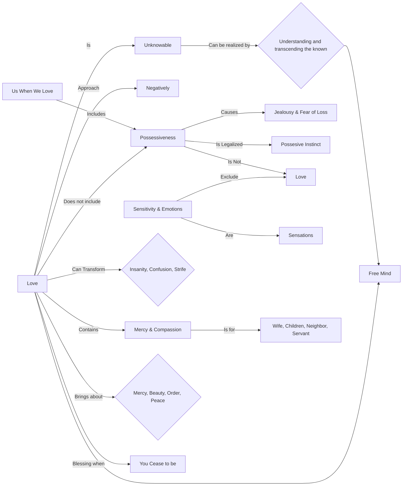

April 11
What do you mean by love?

Love is the unknowable. It can be realized only when the known is understood and transcended. Only when the mind is free of the known, then only there will be love. So, we must approach love negatively, not positively.
What is love to most of us? With us, when we love, in it there is possessiveness, dominance, or subservience. From this possession arises jealously and fear of loss, and we legalize this possessive instinct. From possessiveness arise jealousy and the innumerable conflicts with which each one is familiar. Possessiveness, then, is not love. Nor is love sentimental. To be sentimental, to be emotional, excludes love. Sensitivity and emotions are merely sensations.
...Love alone can transform insanity, confusion, and strife. No system, no theory of the left or of the right can bring peace and happiness to man. Where there is love, there is no possessiveness, no envy; there is mercy and compassion, not in theory, but actually—for your wife and for your children, for your neighbor and for your servant. Love alone can bring about mercy and beauty, order and peace. There is love with its blessing when “you” cease to be.

