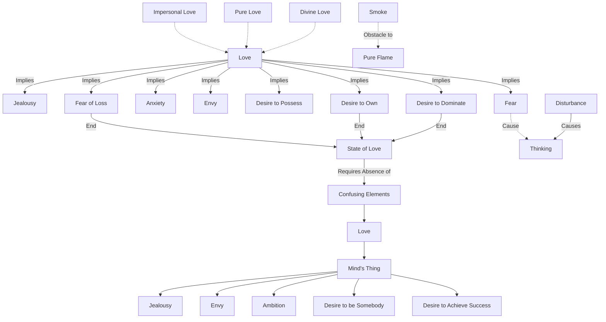

April 12
As long as we possess, we shall never love

We know love as sensation, do we not? When we say we love, we know jealousy, we know fear, we know anxiety. When you say you love someone, all that is implied: envy, the desire to possess, the desire to own, to dominate, the fear of loss, and so on. All this we call love, and we do not know love without fear, without envy, without possession; we merely verbalize that state of love which is without fear, we call it impersonal, pure, divine, or God knows what else; but the fact is that we are jealous, we are dominating, possessive. We shall know that state of love only when jealousy, envy, possessiveness, domination, come to an end; and as long as we possess, we shall never love...When do you think about the person whom you love? You think about her when she is gone, when she is away, when she has left you. So, you miss the person whom you say you love only when you are disturbed, when you are in suffering; and as long as you possess that person, you do not have to think about that person, because in possession there is no disturbance.
Thinking comes when you are disturbed—and you are bound to be disturbed as long as your thinking is what you call love. Surely, love is not a thing of the mind; and because the things of the mind have filled our hearts, we have no love. The things of the mind are jealousy, envy, ambition, the desire to be somebody, to achieve success. These things of the mind fill your hearts, and then you say you love; but how can you love when you have all these confusing elements in you? When there is smoke, how can there be a pure flame?

