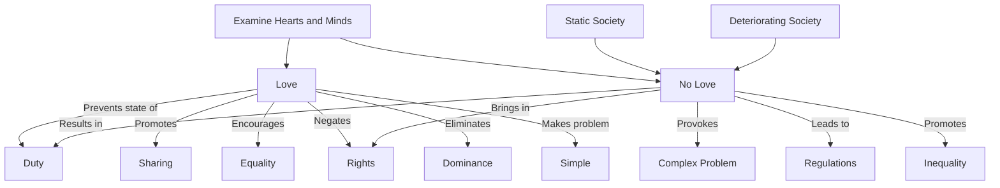

April 13
Love is not a duty

When there is love, there is no duty. When you love your wife, you share everything with her—your property, your trouble, your anxiety, your joy. You do not dominate. You are not the man and she the woman to be used and thrown aside, a sort of breeding machine to carry on your name. When there is love, the word duty disappears. It is the man with no love in his heart who talks of rights and duties, and in this country duties and rights have taken the place of love. Regulations have become more important than the warmth of affection. When there is lo ve, the problem is simple; when there is no love, the problem becomes complex. When a man loves his wife and his children, he can never possibly think in terms of duty and rights. Sirs, examine your own hearts and minds. I know you laugh it off—that is one of the tricks of the thoughtless, to laugh at something and push it aside. Your wife does not share your responsibility, your wife does not share your property, she does not have the half of everything that you have because you consider the woman less tha n yourself, something to be kept and to be used sexually at your convenience when your appetite demands it. So you have invented the words rights and duty; and when the woman rebels, you throw at her these words. It is a static society, a deteriorating society, that talks of duty and rights. If you really examine your hearts and minds, you will find that you have no love.

