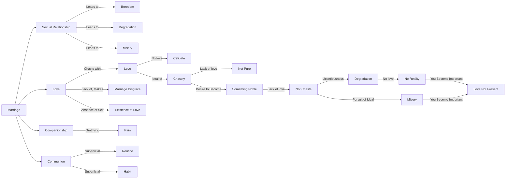

April 15
In considering marriage

We are trying to understand the problem of marriage, in which is implied sexual relationship, love, companionship, communion. Obviously if there is no love, marriage becomes a disgrace, does it not? Then it becomes mere gratification. To love is one of the most difficult things, is it not? Love can come into being, can exist only when the self is absent. Without love, relationship is a pain; however gratifying, or however superficial, it leads to boredom, to routine, to habit with all its implications. Then, sexual problems become all important. In considering marriage, whether it is necessary or not, one must first comprehend love. Surely, love is chaste, without love you cannot be chaste; you may be a celibate, whether a man or a woman, but that is not being chaste, that is not being pure, if there is no love. If you have an ideal of chastity, that is if you want to become chaste, there is no love in it either because it is merely the desire to become something which you think is noble, which you think will help you to find Reality; there is no love there at all. Licentiousness is not chaste, it leads only to degradation, to misery. So does the pursuit of an ideal. Both exclude love, both imply becoming something, indulging in something and therefore you become important and where you are important, love is not.

