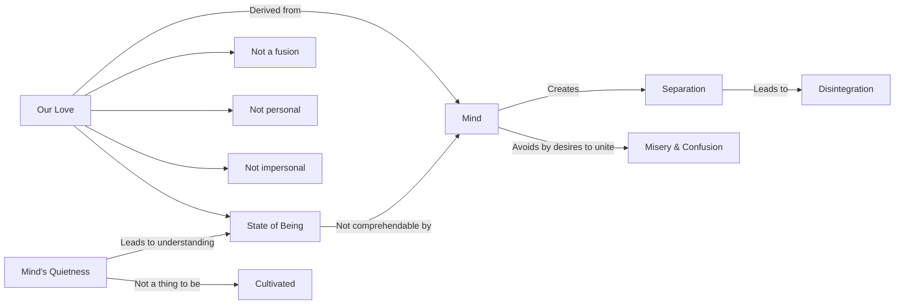

April 14
A thing of the mind

What we call our love is a thing of the mind. Look at yourselves, Sirs, and Ladies, and you will see that what I am saying is obviously true; otherwise, our lives, our marriage, our relationships, would be entirely different, we would have a new society. We bind ourselves to another, not through fusion, but through contract, which is called love, marriage. Love does not fuse, adjust—it is neither personal nor impersonal, it is a state of being. The man who desires to fuse with something greater, to unite himself with another, is avoiding misery, confusion; but the mind is still in separation, which is dis integration. Love knows neither fusion nor diffusion, it is nether personal nor impersonal, it is a state of being which the mind can not find; it can describe it, give it a term, a name, but the word, the description, is not love. It is only when the mind is quiet that it shall know love, and that state of quietness is not a thing to be cultivated.

