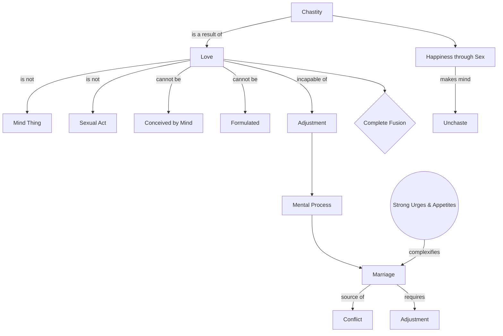

April 16
Love is incapable of adjustment

Love is not a thing of the mind, is it? Love is not merely the sexual act, is it? Love is something which the mind can not possibly conceive. Love is something which cannot be formulated. And without love, you become related; without love, you marry. Then, in that marriage, you “adjust yourselves” to each other. Lovely phrase! You adjust yourselves to each other, which is again an intellectual process, is it not?...This adjustment is obviously a mental process. All adjustments are. But, surely, love is incapable of adjus tment. You know, Sirs, don’t you?, that if you love another, there is no “adjustment.” There is only complete fusion. Only when there is no love, do we begin to adjust. And this adjustment is called marriage. Hence, marriage fails, because it is the very source of conflict, a battle between two people. It is an extraordinarily complex problem, like all problems, but more so because the appetites, the urges, are so strong. So, a mind which is merely adjusting itself can never be chaste. A mind which is seeking happiness through sex can never bechaste. Though you may momentarily have, in that act, self-abnegation, self- forgetfulness, the very pursuit of that happiness, which is of the mind, makes the mind unchaste. Chastity comes into being only where there is love.

