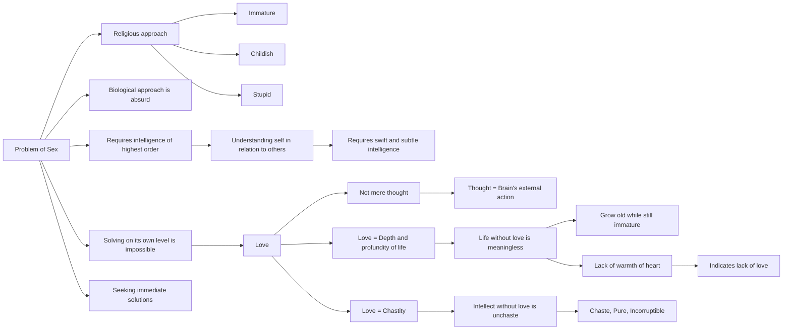

April 17
To love is to be chaste

This problem of sex is not simple and it cannot be solved on its own level. To try to solve it purely biologically is absurd; and to approach it through religion or to try to solve it as though it were a mere matter of physical adjustment, of glandular action, or to hedge it in with taboos and condemnations is all too immature, childish, and stupid. It requires intelligence of the highest order. To understand ourselves in our relationship with another requires intelligence far more swift and subtle than to understand nature. But we seek to understand without intelligence; we want immediate action, an immediate solution, and the problem becomes more and more important...Love is not mere thought; thoughts are only the external action of the brain. Love is much deeper, much more profound, and the profundity of life can be discovered only in love. Without love, life has no meaning and that is the sad part of our existence. We grow old while still immature; our bodies become old, fat, and ugly, and we remain thoughtless. Though we read and talk about it, we have never known the perfume of life. Mere reading and verbalizing indicates an utter lack of the warmth of heart that enriches life; and without that quality of love, do what you will, join any society, bring about any law, you will not solve this problem. To love is to be chaste. Mere intellect is not chastity. The man who tries to be chaste in thought, is unchaste, because he has no love. Only the man who loves is chaste, pure, incorruptible.

