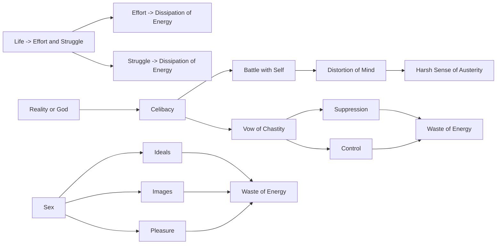

April 18
Constant thought is a waste of energy

Most of us spend our life in effort, in struggle; and the effort, the struggle, the striving, is a dissipation of that energy. Man, throughout the historical period of man, has said that to find that reality or God—whatever name he may give to it—you must be celibate; that is, you take a vow of chastity and suppress, control, battle with yourself endlessly all your life, to keep your vow. Look at the waste of energy! It is also a waste of energy to indulge. And it has far more significance when you suppress. The effort that has gone into suppression, into control, into this denial of your desire distorts your mind, and through that distortion you have a certain sense of austerity which becomes harsh. Please listen. Observe it in yourself and observe the people around you. And observe this waste of energy, the battle. Not the implications of sex, not the actual act, but the ideals, the images, the pleasure—the constant thought about them is a waste of energy. And most people waste their energy either through denial, or through a vow of chastity, or in thinking about it endlessly.

