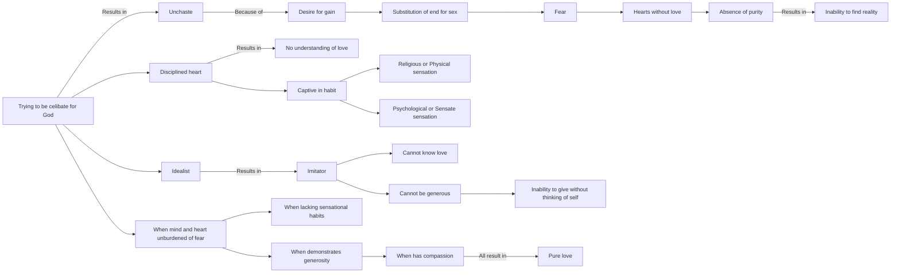

April 19
The idealist cannot know love

Those who are trying to be celibate in order to achieve God are unchaste for they are seeking a result or gain and so substituting the end, the result, for sex—which is fear. Their hearts are without love, and there can be no purity, and a pure heart alone can find reality. A disciplined heart, a suppressed heart, cannot know what love is. It cannot know love if it is caught in habit, in sensation—religious or physical, psychological or sensate. The idealist is an imitator and therefore he cannot know love. He cannot be generous, give himself over completely without the thought of himself. Only when the mind and heart are unburdened of fear, of the routine of sensational habits, when there is generosity and compassion, there is love. Such love is chaste.

