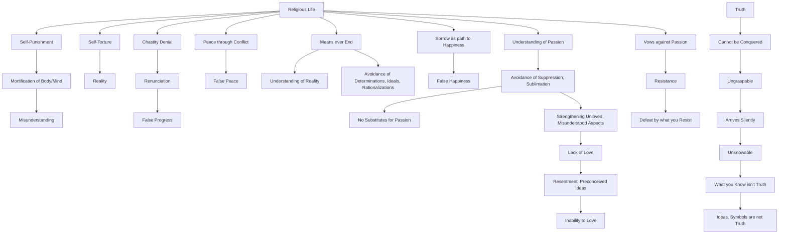

April 20
Understanding passion

Is it a religious life to punish oneself? Is mortification of the body or of the mind a sign of understanding? Is self-torture a way to reality? Is chastity denial? Do you think you can go far through renunciation? Do you really think there can be peace through conflict? Does not the means matter infinitely more than the end? The end may be, but the means is. The actual, the what is, must be understood and not smothered by determinations, ideals and clever rationalizations. Sorrow is not the way of happiness. The thing called passion has to be understood and not suppressed or sublimated, and it is no good finding a substitute for it. Whatever you may do, any device that you invent, will only strengthen that which has not been loved and understood. To love what we call passion is to understand it. To love is to be in direct communion; and you cannot love something if you resent it, if you have ideas, conclusions about it. How can you love and understand passion if you have taken a vow against it? A vow is a form of resistance, and what you resist ultimately conquers you. Truth is not to be conquered; you cannot storm it; it will slip through your hands if you try to grasp it. Truth comes silently, without your knowing. What you know is not truth, it is only an idea, a symbol. The shadow is not the real.

