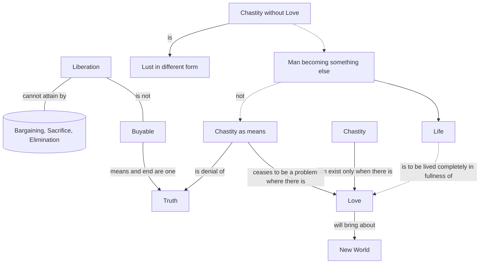

April 21
Means and end are one

Create a Mermaid Concept Map Diagram in text format identifying key concepts and keeping their names short  and name their relationships from this corresponding underlying text below from Jiddu Krishnamurti,  do not provide explanations or any further list or notes, only provide this Mermaid Concept Map Diagram in text format.

For the attainment of liberation, nothing is necessary. You cannot attain it through bargaining, through sacrifice, through elimination; it is not a thing that you can buy. If you do these things, you will get a thing of the marketplace, therefore not real. Truth cannot be bought, there is no means to truth; if there is a means, the end would not be truth, because means and end are one, they are not separate. Chastity as a means to liberation, to truth, is a denial of truth. Chastity is not a coin with which you buy it...
Why do we think chastity is essential?...What do we mean by sex? Not merely the act but thinking about it, feeling about it, anticipating it, escaping from it — that is our problem. Our problem is sensation, wanting more and more. Watch yourself, don’t watch your neighbor. Why are your thoughts so occupied with sex? Chastity can exist only when there is love, and without love there is no chastity. Without love, chastity is merely lust in a different form. To become chaste is to become something else; it is like a man becoming powerful, succeeding as a prominent lawyer, politician, or whatever else—the change is on the same level. That is not chastity but merely the end result of a dream, the outcome of the continual resistance to a particular desire...So, chastity ceases to be a problem where there is love. Then life is not a problem, life is to be lived completely in the fullness of love, and that revolution will bring about a new world.

