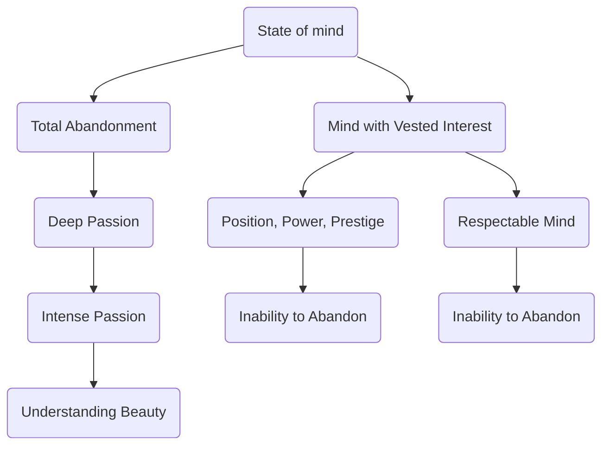

April 22
Total abandonment

Perhaps you have never experienced that state of mind in which there is total abandonment of everything, a complete letting go. And you cannot abandon everything without deep passion, can you? You cannot abandon everything intellectually or emotionally. There is total abandonment, surely, only when there is intense passion. Don’t be alarmed by that word because a man who is not passionate, who is not intense, can never understand or feel the quality of beaut y. The mind that holds something in reserve, the mind that has a vested interest, the mind that clings to position, power, prestige, the mind that is respectable, which is a horror—such a mind can never abandon itself.

