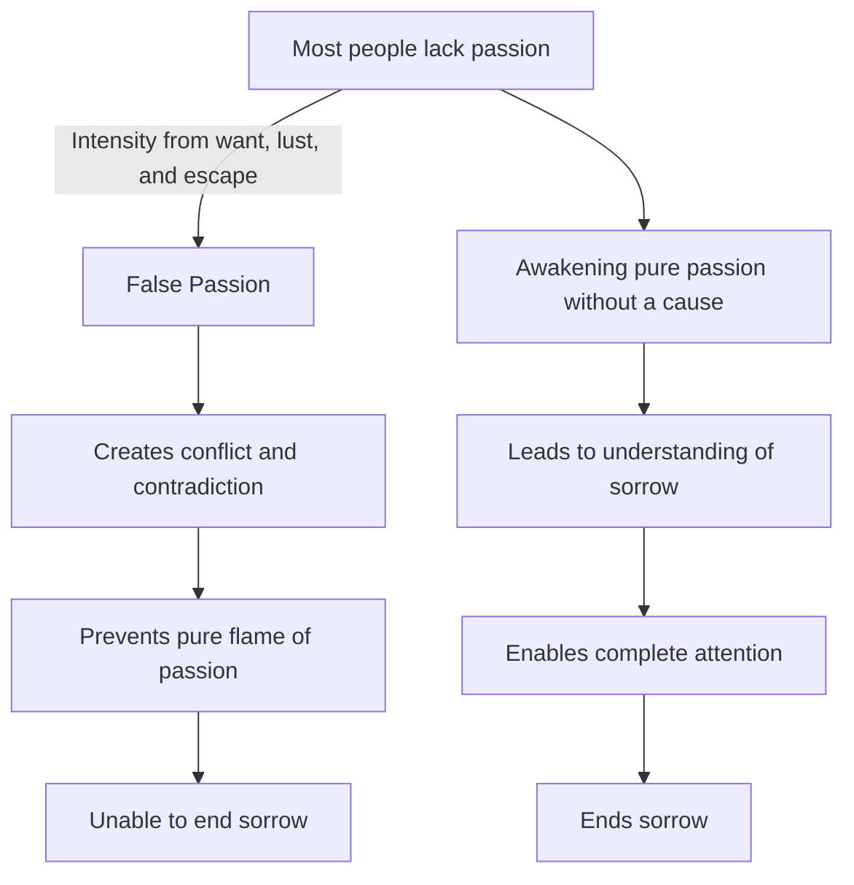

April 23
This pure flame of passion

In most of us there is very little passion. We may be lustful, we may be longing for something, we may be wanting to escape from something, and all this does give one a certain intensity. But unless we awaken and feel our way into this flame of passion without a cause, we shall not be able to understand that which we call sorrow. To understand something you must have passion, the intensity of complete attention. Where there is the passion for something, which produces contradiction, conflict, this pure flame of passion cannot be; and this pure flame of passion must exist in order to end sorrow, dissipate it completely.

