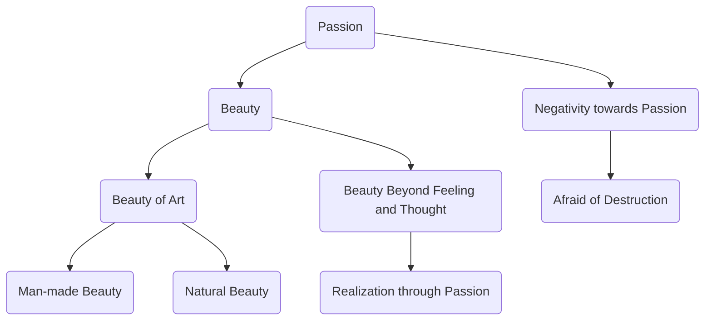

April 24
Beauty beyond feeling

Without passion how can there be beauty? I do not mean the beauty of pictures, buildings, painted women, and all the rest of it. They have their own forms of beauty. A thing put together by man, like a cathedral, a temple, a picture, a poem, or a statue may or may not be beautiful. But there is a beauty which is beyond feeling and thought and which cannot be realized, understood, or known if there is not passion. So do not misunderstand the word passion. It is not an ugly word; it is not a thing you can buy in the market or talk about romantically. It has nothing whatever to do with emotion, feeling. It is not a respectable thing; it is a flame that destroys anything that is false. And we are always so afraid to allow that flame to devour the things that we hold dear, the things that we call important.

