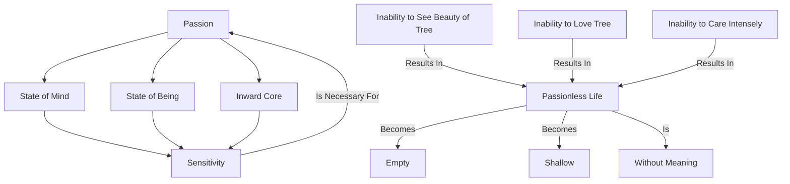

April 25
A passion for everything

For most of us, passion is employed only with regard to one thing, sex; or you suffer passionately and try to resolve that suffering. But I am using the word passion in the sense of a state of mind, a state of being, a state of your inward core, if there is such a thing, that feels very strongly, that is highly sensitive—sensitive alike to dirt, to squalor, to poverty, and to enormous riches and corruption, to the beauty of a tree, of a bird, to the flow of water, and to a pond that has the evening sky reflected upon it. To feel all this intensely, strongly, is necessary. Because without passion life becomes empty, shallow , and without much meaning. If you cannot see the beauty of a tree and love that tree, if you cannot care for it intensely, you are not living.

