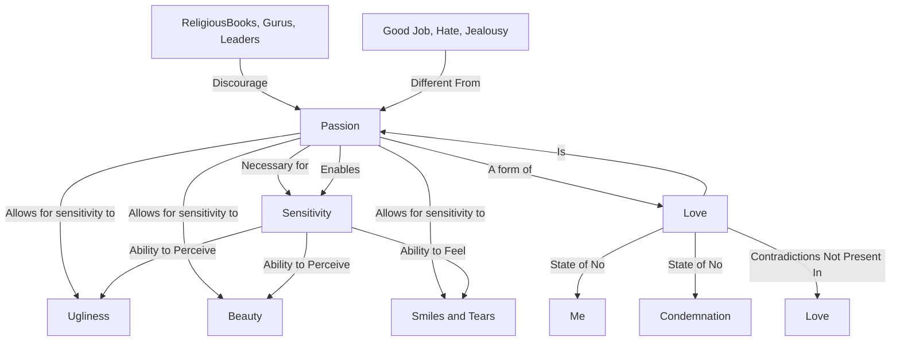

April 26
Love, I assure you, is passion

You cannot be sensitive if you are not passionate. Do not be afraid of that word passion. Most religious books, most gurus, swamis, leaders, and all the rest of them, say, “Don’t have passion.” But if you have no passion, how can you be sensitive to the ugly, to the beautiful, to the whispering leaves, to the sunset, to a smile, to a cry? How can you be sensitive without a sense of passion in which there is abandonment? Sirs, please listen to me, and do not ask how to acquire passion. I know you are all passionate enough in getting a good job, or hating some poor chap, or being jealous of someone; but I am talking of something entirely different —a passion that loves. Love is a state in which there is no “me”; love is a state in which there is no condemnation, no saying that sex is right or wrong, that this is good and something else is bad. Love is none of these contradictory things. Contradiction does not exist in love. And how can one love if one is not passio nate? Without passion, how can one be sensitive? To be sensitive is to feel your neighbor sitting next to you; it is to see the ugliness of the town with its squalor, its filth, its poverty, and to see the beauty of the river, the sea, the sky. If you are not passionate, how can you be sensitive to all that? How can you feel a smile, a tear? Love, I assure you, is passion.
