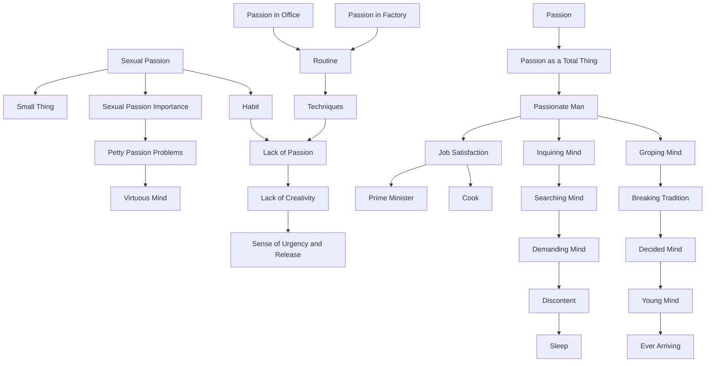

April 27
A passionate mind is inquiring

Obviously there must be passion, and the question is how to revive that passion. Do not let us misunderstand each other. I mean passion in every sense, not merely sexual passion which is a very small thing. And most of us are satisfied with that because every other passion has been destroyed—in the office, in the factory, through following a certain job, routine, learning techniques—so there is no passion left; there is no creative sense of urgency and release. Therefore sex becomes important to us, and there we get lost in petty passion which becomes an enormous problem to the narrow, virtuous mind, or else it soon becomes a habit and dies. I am using the word passion as a total thing. A passionate man who feels strongly is not satisfied merely with some little job—whether it be the job of a prime minister, or of a cook, or what you will. A mind that is passionate is inquiring, searching, looking, asking, demanding, not merely trying to find for its discontent some object in which it can fulfill itself and go to sleep. A passionate mind is groping, seeking, breaking through, not accepting any tradition; it is not a decided mind, not a mind that has arrived, but it is a young mind that is ever arriving.

