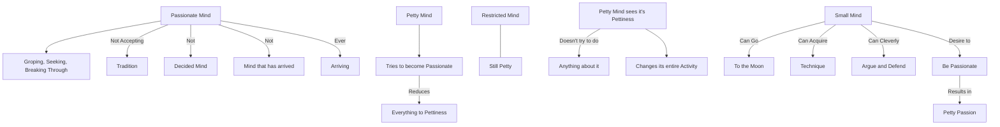

April 28
Petty mind

A passionate mind is groping, seeking, breaking through, not accepting any tradition; it is not a decided mind, not a mind that has arrived, but it is a young mind that is ever arriving.
Now, how is such a mind to come into being? It must happen. Obviously, a petty mind cannot work at it. A petty mind trying to become passionate will merely reduce everything to its own pettiness. It must happen, and it can only happen when the mind sees its own pettiness and yet does not try to do anything about it. Am I making myself clear? Probably not. But as I said earlier, any restricted mind, however eager it is, will still be petty, and surely that is obvious. A small mind, though it can go to the moon, though it can acquire a technique, though it can cleverly argue and defend, is still a small mind. So when the small mind says, “I must be passionate in order to do something worthwhile,” obviously its passion will be very petty, will it not—like getting angry about some petty injustice or thinking that the whole world is changing because of some petty, little reform done in a potty, little village by a potty, little mind. If the little mind sees all that, then the very perception that it is small is enough; then its whole activity undergoes a change.

