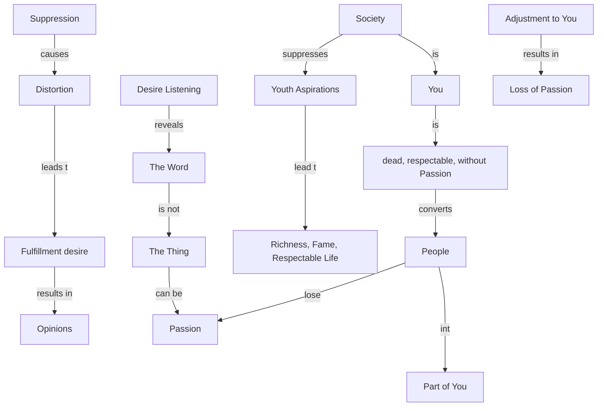

April 29
Lost passion

The word is not the thing. The word passion is not passion. To feel that and to be caught in it without any volition or directive or purpose, to listen to this thing called desire, to listen to your own desires which you have, plenty of them, weak or strong—when you do that, you will see what a tremendous damage you do when you suppress desire, when you distort it, when you want to fulfill it, when you want to do something about it, when you have an opinion about it.
Most people have lost this passion. Probably one has had it once in one’s youth—to become a rich man, to have fame and to live a bourgeois or a respectable life; perhaps a vague muttering of that. And society—which is what you are—suppresses that. And so one has to adjust oneself to you who are dead, who are respectable, who have not even a spark of passion; and then one becomes a part of you, and thereby loses this passion.

