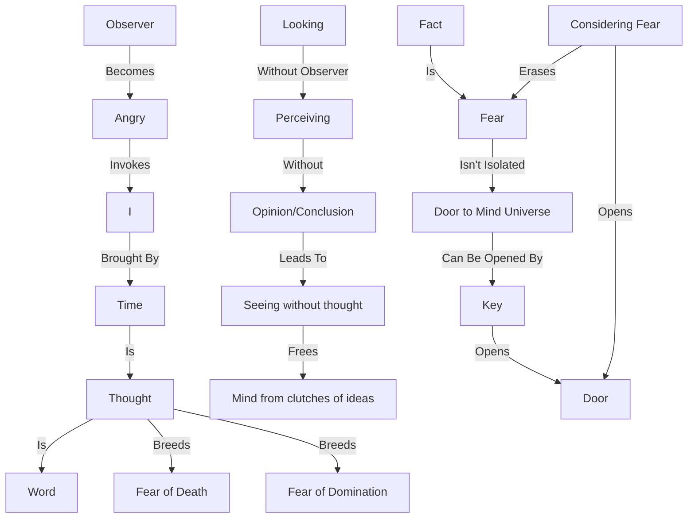

March 30
How do I look at anger?

Obviously, I look at it as an observer being angry. I say, “I am angry.” At the moment of anger there is no “I”, the “I” comes in immediately afterwards—which means time. Can I look at the fact without the factor of time, which is the thought, which is the word? This happens when there is the looking without the observer. See where it has led me. I now begin to perceive a way of looking — perceiving without the opinion, the conclusion, without condemning, judging. Therefore I perceive that there can be “seeing” without thought, which is the word. So the mind is beyond the clutches of ideas, of the conflict of duality and all the rest of it. So, can I look at fear not as an isolated fact?
If you isolate a fact that has not opened the door to the whole universe of the mind, then let us go back to the fact and begin again by taking another fact so that you yourself will begin to see the extraordinary thing of the mind, so that you have the key, you can open the door, you can burst into that.
By considering one fear — the fear of death, the fear of the neighbor, the fear of your spouse dominating over you, you know the whole business of domination — will that open the door? That is all that matters — not how to be free of it—because the moment you open the door, fear is completely wiped away. The mind is the result of time, and time is the word — how extraordinary to think of it! Time is thought; it is thought that breeds fear, it is thought that breeds the fear of death; and it is time which is thought, that has in its hand the whole intricacies and the subtleties of fear.

