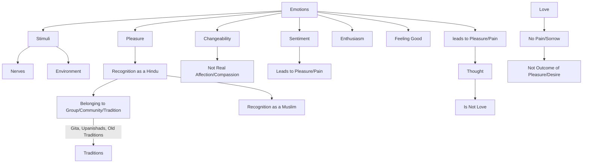

May 2
What role has emotion in life?

How do emotions come into being? Very simple. They come into being through stimuli, through the nerves. You put a pin into me, I jump, you flatter me and I am delighted; you insult me and I don’t like it. Through our senses emotions come into being. And most of us function through our emotion of pleasure; obviously, sir. You like to be recognized as a Hindu. Then you belong to a group, to a community, to a tradition, however old; and you like that, with the Gita, the Upanishads and the old traditions, mountain high. And the Muslim likes his and so on. Our emotions have come into being through stimuli, through environment, and so on. It is fairly obvious.
What role has emotion in life? Is emotion life? You understand? Is pleasure love? Is desire love? If emotion is love, there is something that changes all the time. Right? Don’t you know all that?
So one has to realize that emotions, sentiment, enthusiasm, the feeling of being good, and all that have nothing whatsoever to do with real affection, compassion. All sentiment, emotions have to do with thought and therefore lead to pleasure and pain. Love has no pain, no sorrow, because it is not the outcome of pleasure or desire.

