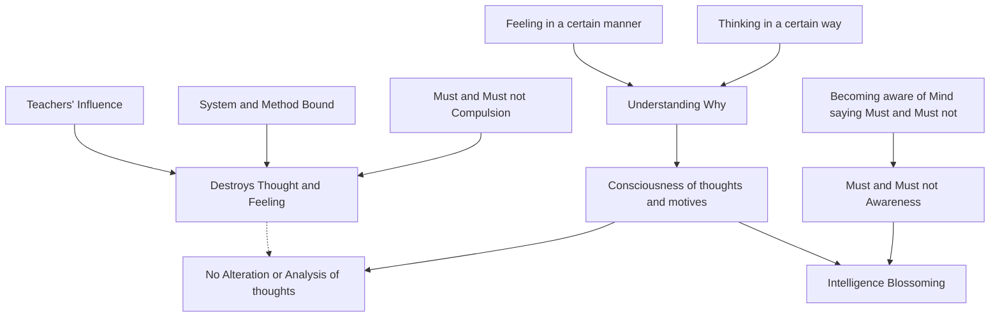

May 3
Feeling intelligence

The very first thing to do, if I may suggest it, is to find out why you are thinking in a certain way, and why you are feeling in a certain manner. Don’t try to alter it, don’t try to analyze your thoughts and your emotions; but become conscious of why yo u are thinking in a particular groove and from what motive you act. Although you can discover the motive through analysis, although you may find out something through analysis, it will not be real; it will be real only when you are intensely aware at the moment of the functioning of your thought and emotion; then you will see their extraordinary subtlety, their fine delicacy. So long as you have a “must” and a “must not,” in this compulsion you will never discover that swift wandering of thought and emotion. And I am sure you have been brought up in the school of “must” and “must not” and hence you have destroyed thought and feeling. You have been bound and crippled by systems, methods, by your teachers. So leave all those “must” and “must nots.” This does not mean that there shall be licentiousness, but become aware of a mind that is ever saying, “I must,” and “I must not.” Then as a flower blossoms forth of a morning, so intelligence happens, is there, functioning, creating comprehension.

