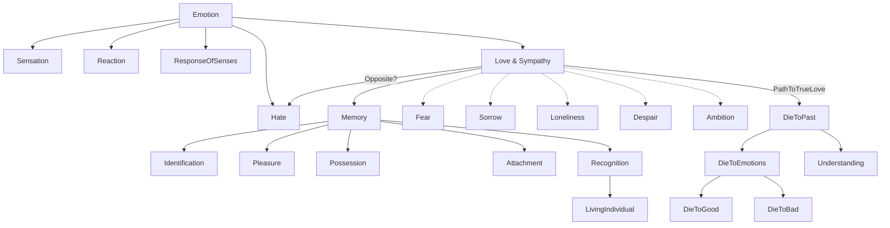

May 6
We must die to all our emotions

What do we mean by emotion? Is it a sensation, a reaction, a response of the senses? Hate, devotion, the feeling of love or sympathy for another—they are all emotions. Some, like love and sympathy, we call positive, while others, like hate, we call negative and want to get rid of. Is love the opposite of hate? And is love an emotion, a sensation, a feeling that is stretched out through memory?
So, what do we mean by love? Surely, love is not memory. That is very difficult for us to understand because for most of us, love is memory. When you say that you love your wife or your husband, what do you mean by that? Do you love that which gives you pleasure? Do you love that with which you have identified yourself and which you recognize as belonging to you? Please, these are facts; I am not inventing anything, so don’t look horrified.
It is the image, the symbol of “my wife” or “my husband” that we love, or think we love, not the living individual. I don’t know my wife or my husband at all; and I can never know that person as long as knowing means recognition. For recognition is based on memory — memory of pleasure and pain, memory of the things I have lived for, agonized over, the things I possess and to which I am attached. How can I love when there is fear, sorrow, loneliness, the shadow of despair? How can an ambitious man love? And we are all very ambitious, however honorably.
So, really to find out what love is, we must die to the past, to all our emotions, the good and the bad — die effortlessly, as we would to a poisonous thing because we understand it.

