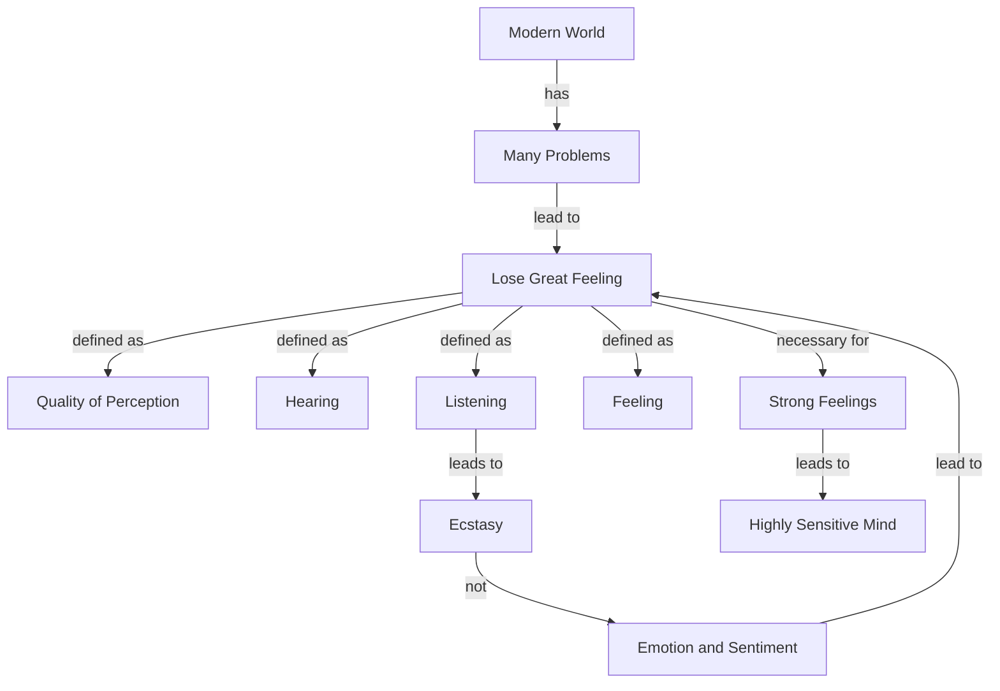

May 7
One must have great feelings

In the modern world where there are so many problems, one is apt to lose great feeling. I mean by that word feeling, not sentiment, not emotionalism, not mere excitement, but that quality of perception, the quality of hearing, listening, the quality of feeling, a bird singing on a tree, the movement of a leaf in the sun. To feel things greatly, deeply, penetratingly, is very difficult for most of us because we have so many problems. Whatever we seem to touch turns into a problem. And, apparently, there is no end to man’s problems, and he seems utterly incapable of resolving them because the more the problems exist, the less the feelings become.
I mean by “feeling” the appreciation of the curve of a branch, the squalor, the dirt on the road, to be sensitive to the sorrow of another, to be in a state of ecstasy when we see a sunset. These are not sentiments, these are not mere emotions. Emotion and sentiment or sentimentality turn to cruelty, they can be used by society; and when there is sentiment, sensation, then one becomes a slave to society. But one must have great feelings. The feeling for beauty, the feeling for a word, the silence between two words, and the hearing of a sound clearly — all that generates feeling. And one must have strong feelings, because it is only the feelings that make the mind highly sensitive.

