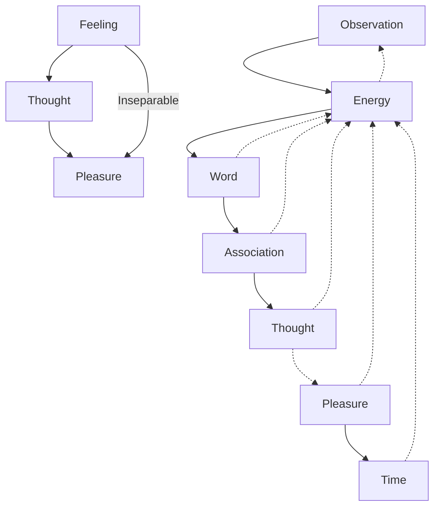

May 8
Observation without thought

There is no feeling without thought; and behind thought is pleasure; so those things go together: pleasure, the word, the thought, the feeling; they are not separated. Observation without thought, without feeling, without word is energy. Energy is dissipated by word, association, thought, pleasure and time; therefore there is no energy to look.

