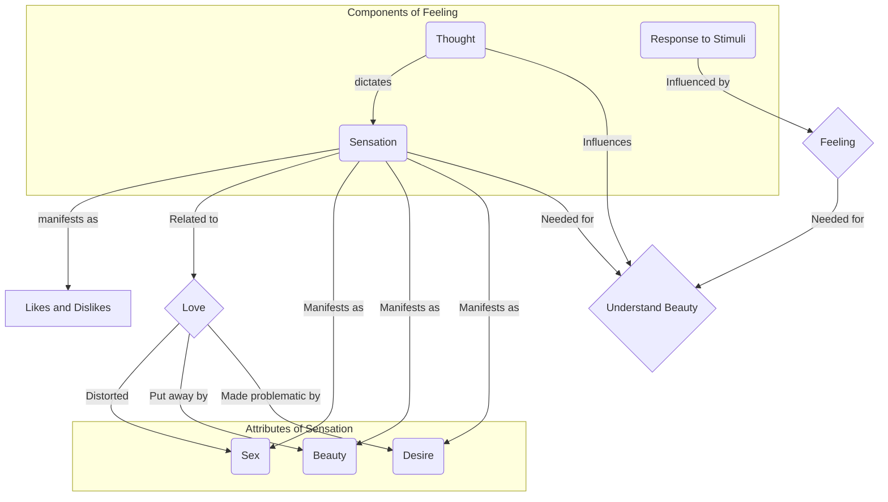

May 9
The totality of feeling

What is feeling? Feeling is like thought. Feeling is a sensation. I see a flower and I respond to that flower; I like it or dislike it. The like or the dislike is dictated by my thought, and the thought is the response of the background of memory. So, I say, “I like that flower,” or “I do not like that flower;” “I like this feeling” or “I do not like that feeling.”...Now, is love related to feeling? Feeling is sensation, obviously—sensation of like and dislike, of good and bad, of good taste and all the rest of it. Is that feeling related to love?...Have you watched your street, have you watched the way you live in your houses, the way you sit, the way you talk? And have you noticed all your saints whom you worship? For them passion is sex, and therefo re they deny passion, therefore they deny beauty—deny in the sense of putting those aside. So, with sensation you have put away love because you say, “Sensation will make me a prisoner, I will be a slave to sex—desire; therefore I must cut it out.” Therefore you have made sex into an immense problem...When you have understood feeling completely, not partially, when you have really understood the totality of feeling, then you will know what love is. When you can see the beauty of a tree, when you can see the beauty of a smile, when you can see the sun setting behind the walls of your town—see totally—then you will know what love is.

