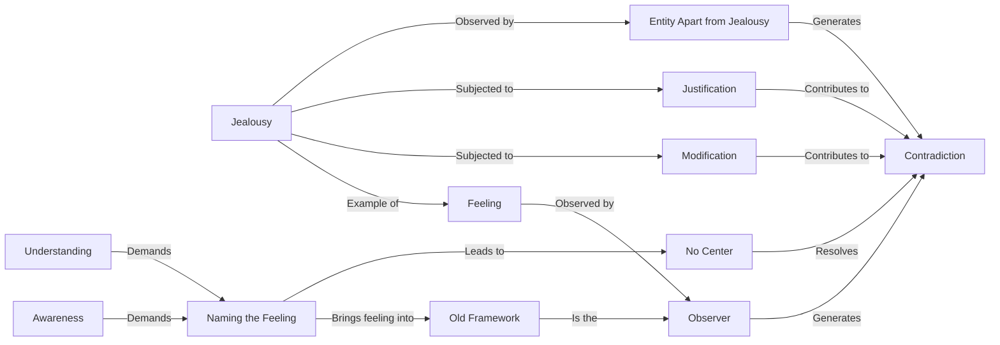

May 10
If you do not name that feeling

When you observe a feeling, that feeling comes to an end. But even though the feeling comes to an end, if there is an observer, a spectator, a censor, a thinker who remains apart from the feeling, then there is still a contradiction. So it is very important to understand how we look at a feeling.
Take, for instance, a very common feeling: jealousy. We all know what it is to be jealous. Now, how do you look at your jealousy? When you look at that feeling, you are the observer of jealousy as something apart from yourself. You try to change jealousy, to modify it, or you try to explain why you are justified in being jealous, and so on and so forth. So there is a being, a censor, an entity apart from jealousy who observes it. For the moment jealousy may disappear, but it comes back again; and it comes back because you do not really see that jealousy is part of you.
What I am saying is that the moment you give a name, a label to that feeling, you have brought it into the framework of the old; and the old is the observer, the separate entity who is made up of words, of ideas, of opinions about what is right and what is wrong. But if you don’t name that feeling — which demands tremendous awareness, a great deal of immediate understanding — then you will find that there is no observer, no thinker, no center from which you are judging, and that you are not different from the feeling. There is no “you” who feels it.

