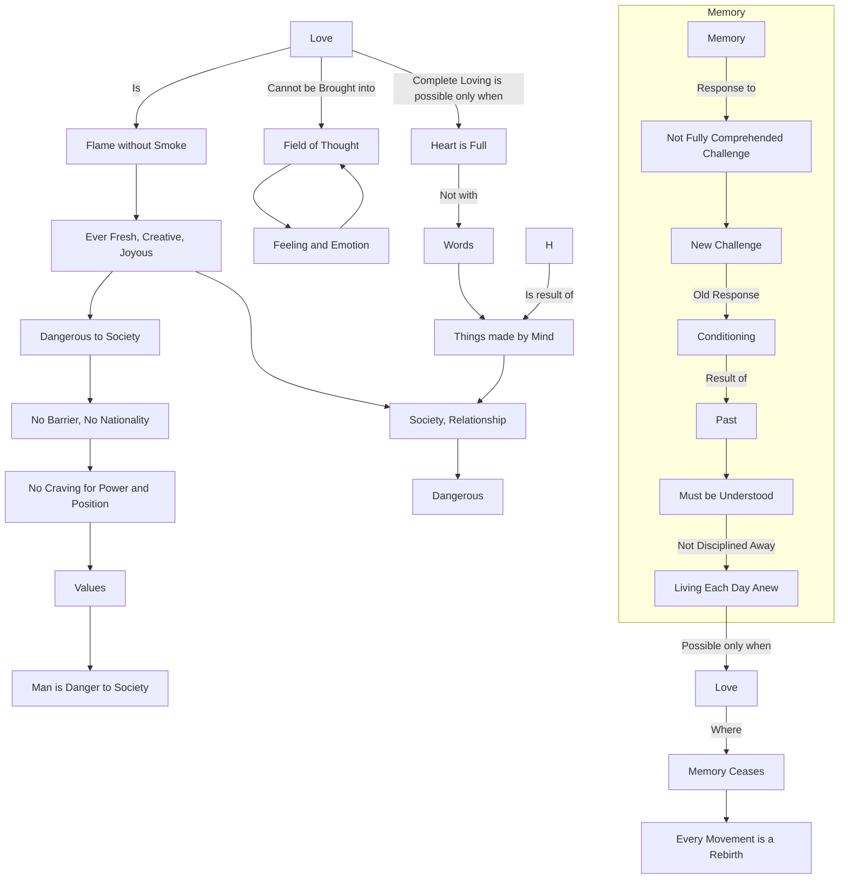

May 12
Memory negates love

Is it possible to love without thinking? What do you mean by thinking? Thinking is a response to memories of pain or pleasure. There is no thinking without the residue which incomplete experience leaves. Love is different from emotion and feeling. Love cannot be brought into the field of thought; whereas feeling and emotion can be brought. Love is a flame without smoke, ever fresh, creative, joyous. Such love is dangerous to society, to relationship. So, thought steps in, modifies, guides it, legalizes it, puts it out of danger; then one can live with it. Do you not know that when you love someone, you love the whole of mankind? Do you not know how dangerous it is to love man? Then, there is no barrier, no nationality; then, there is no craving for power and position, and things assume their values. Such a man is a danger to society.
For the being of love, the process of memory must come to an end. Memory comes into being only when experience is not fully, completely understood. Memory is only the residue of experience; it is the result of a challenge which is not fully comprehended. Life is a process of challenge and response. Challenge is always new but the response is ever old. This response, which is conditioning, which is the result of the past, must be understood and not disciplined or condemned away. It means living each day anew, fully and completely. This complete living is possible only when there is love, when your heart is full, not with the words nor with the things made by the mind. Only where there is love, memory ceases; then every movement is a rebirth.

