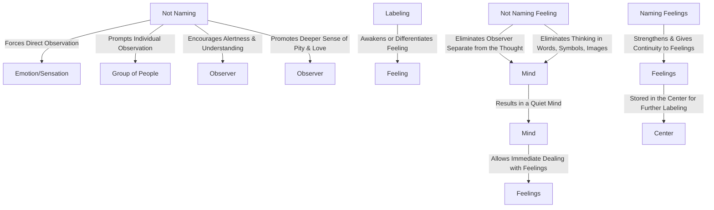

May 13
Do not name a feeling

What happens when you do not name? You look at an emotion, at a sensation, more directly and therefore have quite a different relationship to it, just as you have to a flower when you do not name it. You are forced to look at it anew. When you do not name a group of people, you are compelled to look at each individual face and not treat them all as a mass. Therefore you are much more alert, much more observing, more understanding; you have a deeper sense of pity, love; but if you treat them all as the mass, it is over.
If you do not label, you have to regard every feeling as it arises. When you label, is the feeling different from the label? Or does the label awaken the feeling?
If I do not name a feeling, that is to say if thought is not functioning merely because of words or if I do not think in terms of words, images or symbols, which most of us do — then what happens? Surely the mind then is not merely the observer. When the mind is not thinking in terms of words, symbols, images, there is no thinker separate from the thought, which is the word. Then the mind is quiet, is it not? Not made quiet, it is quiet. When the mind is really quiet, then the feelings which arise can be dealt with immediately. It is only when we give names to feelings and thereby strengthen them that the feelings have continuity; they are stored up in the center, from which we give further labels, either to strengthen or to communicate them.

