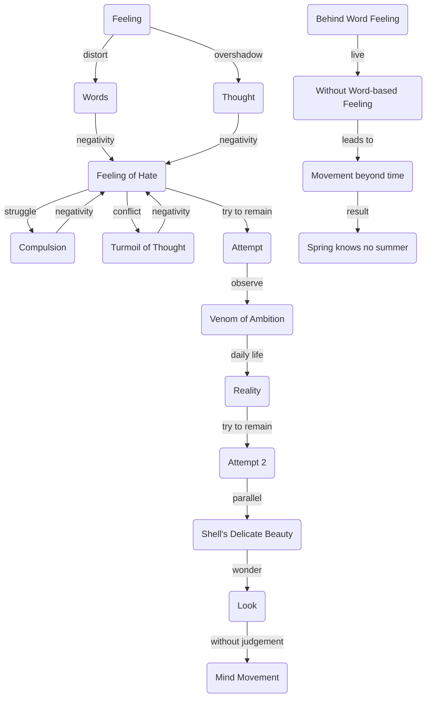

May 14
Remain with a feeling and see what happens

You never remain with any feeling, pure and simple, but always surround it with the paraphernalia of words. The word distorts it; thought, whirling round it, throws it into shadow, overpowers it with mountainous fears and longings. You never remain with a feeling, and with nothing else: with hate, or with that strange feeling of beauty. When the feeling of hate arises, you say how bad it is; there is the compulsion, the struggle to overcome it, the turmoil of thought about it.
Try remaining with the feeling of hate, with the feeling of envy, jealousy, with the venom of ambition; for after all, that’s what you have in daily life, though you may want to live with love, or with the word `love’. Since you have the feeling of hate, of wanting to hurt somebody with a gesture or a burning word, see if you can stay with that feeling. Can you? Have you ever tried? Try to remain with a feeling, and see what happens. You will find it amazingly difficult. Your mind will not leave the feeling alone; it comes rushing in with its remembrances, its associations, its do’s and don’ts, its everlasting chatter. Pick up a piece of shell. Can you look at it, wonder at its delicate beauty, without saying how pretty it is, or what animal made it? Can you look without the movement of the mind? Can you live with the feeling behind the word, without the feeling that the word builds up? If you can, then you will discover an extraordinary thing, a movement beyond the measure of time, a spring that knows no summer.

