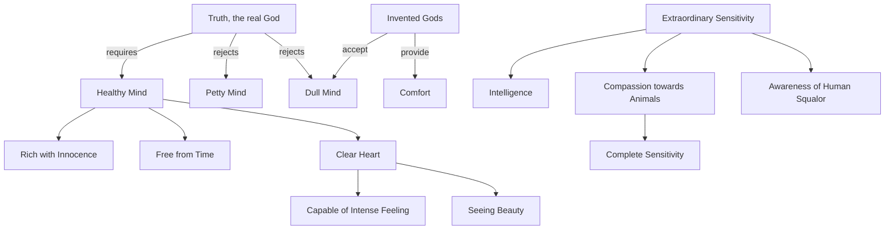

May 1
A mind rich with innocence

Truth, the real God — the real God, not the God that man has made — does not want a mind that has been destroyed, petty, shallow, narrow, limited. It needs a healthy mind to appreciate it; it needs a rich mind — rich, not with knowledge but with innocence — a mind upon which there has never been a scratch of experience, a mind that is free from time. The gods that you have invented for your own comforts accept torture; they accept a mind that is being made dull. But the real thing does not want it; it wants a total, complete human being whose heart is full, rich, clear, capable of intense feeling, capable of seeing the beauty of a tree, the smile of a child, and the agony of a woman who has never had a full meal.
You have to have this extraordinary feeling, this sensitivity to everything — to the animal, to the cat that walks across the wall, to the squalor, the dirt, the filth of human beings in poverty, in despair. You have to be sensitive — which is to feel intensely, not in any particular direction, which is not an emotion which comes and goes, but which is to be sensitive with your nerves, with your eyes, with your body, with your ears, with your voice. You have to be sensitive completely all the time. Unless you are so completely sensitive, there is no intelligence. Intelligence comes with sensitivity and observation.

