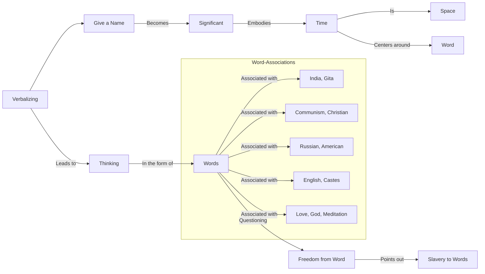

May 15
Understanding words

I do not know if you have ever thought out or gone into this whole process of verbalizing, giving a name. If you have done so, it is really a most astonishing thing and a very stimulating and interesting thing. When we give a name to anything we experience, see or feel, the word becomes extraordinarily significant; and word is time. Time is space, and the word is the center of it. All thinking is verbalization; you think in words. And can the mind be free of the wo rd? Don’t say, “How am I to be free?” That has no meaning. But put that question to yourself and see how slavish you are to words like India, Gita, communism, Christian, Russian, American, English, the caste below you and the caste above you. The word love, the word God, the word meditation—what extraordinary significance we have given to these words and how slavish we are to them.

