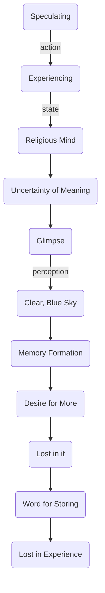

May 16
Memory clouds perception

Are you speculating, or are you actually experiencing as we are going along? You do not know what a religious mind is, do you? From what you have said, you don’t know what it means; you may have just a flutter or a glimpse of it, just as you see the clear, lovely blue sky when the cloud is broken through; but the moment you have perceived the blue sky, you have a memory of it, you want more of it and therefore you are lost in it; the more you want the word for storing it as an experience, the more you are lost in it.

