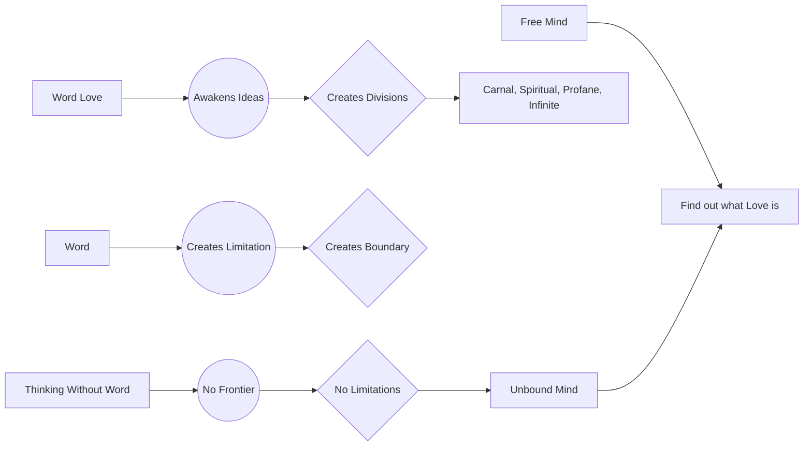

May 17
Words create limitations

Is there a thinking without the word? When the mind is not cluttered up with words, then thinking is not thinking as we know; but it is an activity without the word, without the symbol; therefore it has no frontier — the word is the frontier.
The word creates the limitation, the boundary. And a mind that is not functioning in words, has no limitation; it has no frontiers; it is not bound. Take the word love and see what it awakens in you, watch yourself; the moment I mention that word, you are beginning to smile and you sit up, you feel. So the word love awakens all kinds of ideas, all kinds of divisions such as carnal, spiritual, profane, infinite, and all the rest of it. But find out what love is. Surely, Sir, to find out what love is the mind must be free of that word and the significance of that word.

