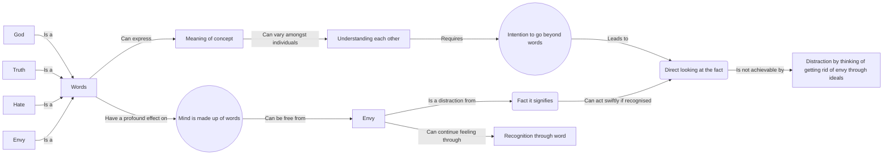

May 18
Going beyond words

To understand each other, I think it is necessary that we should not be caught in words; because, a word like God, for example, may have a particular meaning for you, while for me it may represent a totally different formulation, or no formulation at all. So it is almost impossible to communicate with each other unless both of us have the intention of understanding and going beyond mere words. The word freedom generally implies being free from something, does it not? It ordinarily means being free from greed, from envy, from nationalism, from anger, from this or that. Whereas, freedom may have quite another meaning, which is a sense of being free; and I think it is very important to understand this meaning. After all, the mind is made up of words, amongst other things. Now, can the mind be free of the word “envy”? Experiment with this and you will see that words like God, truth, hate, envy, have a profound effect on the mind. And can the mind be both neurologically and psychologically free of these words? If it is not free of them, it is incapable of facing the fact of envy. When the mind can look directly at the fact which it calls “envy”, then the fact itself acts much more swiftly than the mind’s endeavor to do something about the fact. As long as the mind is thinking of getting rid of envy through the ideal of non-envy, and so on, it is distracted, it is not facing the fact; and the very word envy is a distraction from the fact. The process of recognition is through the word; and the moment I recognize the feeling through the word, I give continuity to that feeling.

