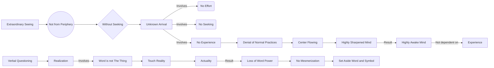

May 19
Extraordinary seeing

So we are asking, as at the beginning, can the mind come to that extraordinary seeing, not from the periphery, from the outside, from the boundary, but come upon it without any seeking? And to come upon it without seeking is the only way to find it. Because in coming upon it unknowingly, there is no effort, no seeking, no experience; and there is the total denial of all the normal practices to come into that center, to that flowering. So the mind is highly sharpened, highly awake, and is no longer dependent upon any experience to keep itself awake.

When one asks oneself, one may ask verbally; for most people, naturally, it must be verbal. And one has to realize that the word is not the thing—like the word “tree,” is not the tree, is not the actual fact. The actual fact is when one touches it, not through the word but when one actually comes into contact with it. Then it is an actuality—which means the word has lost its power to mesmerize people. For example, the word God is so loaded and it has mesmerized people so much that they will accept or deny, and function like a squirrel in a cage! So the word and the symbol must be set aside.

