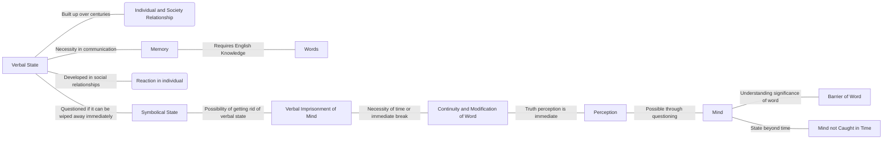

May 20
Perception of truth is immediate

The verbal state has been carefully built up through centuries, in relation between the individual and society; so the word, the verbal state is a social state as well as an individual state. To communicate as we are doing, I need memory, I need words, I must know English, and you must know English; it has been acquired through centuries upon centuries. The word is not only being developed in social relationships, but also as a reaction in that social relationship to the individual; the word is necessary. The question is: it has taken so long, centuries upon centuries, to build up the symbolical, the verbal state, and can that be wiped away immediately? Through time are we going to get rid of the verbal imprisonment of the mind, which has been built up for centuries? Or must it break immediately? Now, you may say, “It must take time, I can’t do it immediately.” This means that you must have many days, this means a continuity of what has been, though it is modified in the process, till you reach a stage where there is no further to go.Can you do that? Because we are afraid, we are lazy, we are indolent, we say “Why bother about all this? It is too difficult”; or “I do not know what to do”— so you postpone, postpone, postpone. But you have to see the truth of the continuation and the modification of the word. The perception of the truth of anything is immediate — not in time. Can the mind break through instantly, on the very questioning? Can the mind see the barrier of the word, understand the significance of the word in a flash and be in that state when the mind is no longer caught in time? You must have experienced this; only it is a very rare thing for most of us.

