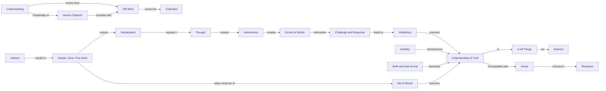

May 21
Subtle truth

You have the flash of understanding, that extraordinary rapidity of insight, when the mind is very still, when thought is absent, when the mind is not burdened with its own noise. So, the understanding of anything — of a modern picture, of a child, of your wife, of your neighbor, or the understanding of truth which is in all things — can only come when the mind is very still. But such stillness can not be cultivated because if you cultivate a still mind, it is not a still mind, it is a dead mind.
The more you are interested in something, the more your intention to understand, the more simple, clear, free the mind is. Then verbalization ceases. After all, thought is word, and it is the word that interferes. It is the screen of words, which is memory, that intervenes between the challenge and the response. It is the word that is responding to the challenge, which we call intellection. So, the mind that is chattering, that is verbalizing, cannot understand truth—truth in relationship, not an abstract truth. There is no abstract truth. But truth is very subtle. It is the subtle that is difficult to follow. It is not abstract. It comes so swiftly, so darkly, it cannot be held by the mind. Like a thief in the night, it comes darkly, not when you are prepared to receive it. Your reception is merely an invitation of greed. So a mind that is caught in the net of words cannot understand truth.

