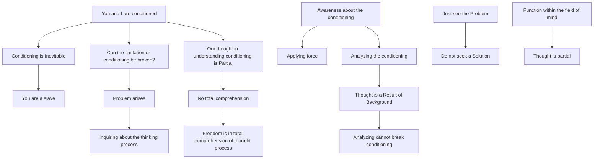

May 22
All thought is partial

You and I realize that we are conditioned. If you say, as some people do, that conditioning is inevitable, then there is no problem; you are a slave, and that is the end of it. But if you begin to ask yourself whether it is at all possible to break down this limitation, this conditioning, then there is a problem; so you will have to inquire into the whole process of thinking, will you not? If you merely say, “I must be aware of my conditioning, I must think about it, analyze it in order to understand and destroy it,” then you are exercising force. Your thinking, your analyzing is still the result of your background, so through your thought you obviously cannot break down the conditioning of which it is a part.
Just see the problem first, don’t ask what is the answer, the solution. The fact is that we are conditioned, and that all thought to understand this conditioning will always be partial; therefore there is never a total comprehension, and only in total comprehension of the whole process of thinking is there freedom. The difficulty is that we are always functioning within the field of the mind, which is the instrument of thought, reasonable or unreasonable; and as we have seen, thought is always partial.

