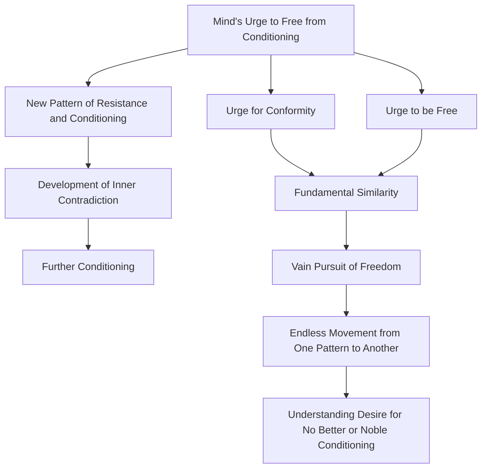

May 25
There is no noble or better conditioning

Does not the urge of the mind to free itself from its conditioning set going another pattern of resistance and conditioning? Having become aware of the pattern or mold in which you have grown up, you want to be free from it; but will not this desire to be free condition the mind again in a different manner? The old pattern insists that you conform to authority, and now you are developing a new one which maintains that you must not conform; so you have two patterns, one in conflict with the other. As long as there is this inner contradiction, further conditioning takes place.
There is the urge that makes for conformity, and the urge to be free. However dissimilar these two urges may seem to be, are they not fundamentally similar? And if they are fundamentally similar, then your pursuit of freedom is vain, for you will only move from one pattern to another, endlessly. There is no noble or better conditioning, and it is this desire that has to be understood.

