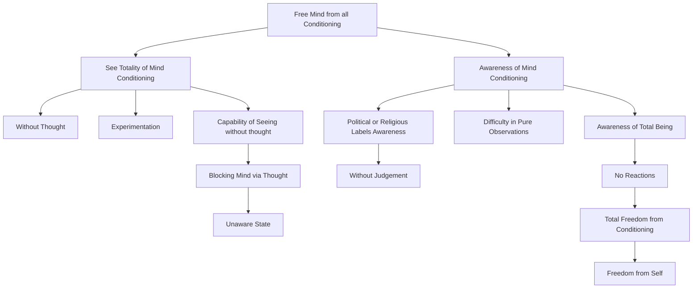

May 23
Freedom from the self

To free the mind from all conditioning, you must see the totality of it without thought. This is not a conundrum; experiment with it and you will see. Do you ever see anything without thought? Have you ever listened, looked, without bringing in this whole process of reaction? You will say that it is impossible to see without thought; you will say no mind can be unconditioned. When you say that, you have already blocked yourself by thought, for the fact is you do not know.
So can I look, can the mind be aware of its conditioning? I think it can. Please experiment. Can you be aware that you are a Hindu, a Socialist, a Communist, this or that, just be aware without saying that it is right or wrong? Because it is such a difficult task just to see, we say it is impossible. I say it is only when you are aware of this totality of your being without any reaction that the conditioning goes, totally. deeply — which is really the freedom from the self.

