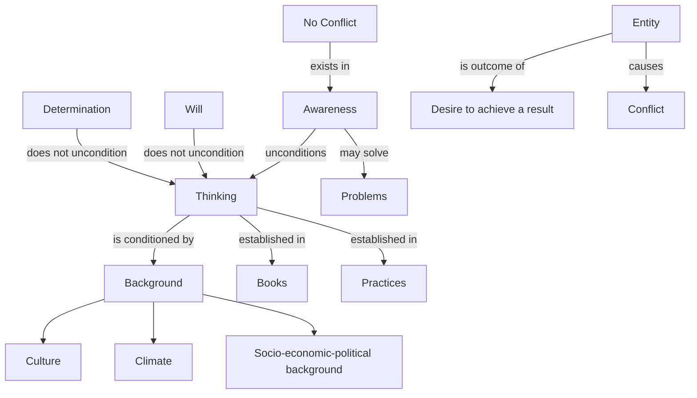

May 24
Awareness may burn away the problems

All thinking obviously is conditioned; there is no such thing as free thinking. Thinking can never be free, it is the outcome of our conditioning, of our background, of our culture, of our climate, of our social, economic, political background. The very books that you read and the very practices that you do are all established in the background, and any thinking must be the result of that background. So if we can be aware—and we can go presently into what it signifies, what it means, to be aware—perhaps we shall be able to unconditional the mind without the process of will, without the determination to uncondition the mind. Because the moment you determine, there is an entity who wishes, an entity who says, “I must uncondition my mind.” That entity itself is the outcome of our desire to achieve a certain result, so a conflict is already there. So, it is possible to be aware of our conditioning, just to be aware—in which there is no conflict at all. That very awareness, if allowed, may perhaps burn away the problems.

