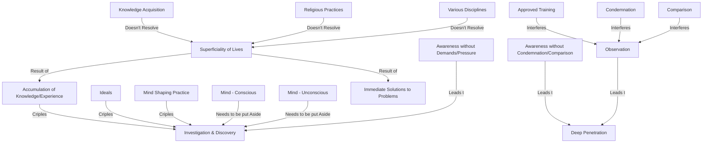

May 27
Simple awareness

Surely any form of accumulation, either of knowledge or experience, any form of ideal, any projection of the mind, any determined practice to shape the mind — what it should be and should not be — all this is obviously crippling the process of investigation and discovery.
So I think our inquiry must be not for the solution of our immediate problems but rather to find out whether the mind — the conscious as well as the deep unconscious mind in which is stored all the tradition, the memories, the inheritance of racial knowledge — whether all of it can be put aside. I think it can be done only if the mind is capable of being aware without any sense of demand, without any pressure — just to be aware. I think it is one of the most difficult things — to be so aware — because we are caught in the immediate problem and in its immediate solution, and so our lives are very superficial. Though one may go to all the analysts, read all the books, acquire much knowledge, attend churches, pray, mediate, practice various disciplines, nevertheless, our lives are obviously very superficial because we do not know how to penetrate deeply. I think the understanding, the way of penetration, how to go very, very deeply, lies through awareness — just to be aware of our thoughts and feelings, without condemnation, without comparison, just to observe. You will see, if you will experiment, how extraordinarily difficult it is, because our whole training is to condemn, to approve, to compare.

