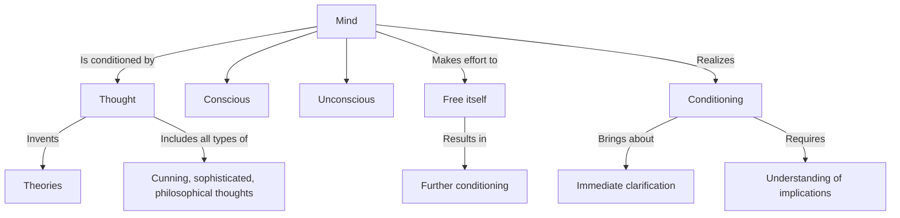

May 28
No part of the mind is unconditioned

Your mind is conditioned right through; there is no part of you which is unconditioned. That is a fact, whether you like it or not. You may say is a part of you — the watcher, the super-soul, the Atma — which is not conditioned; but because you think about it, it is within the field of thought, therefore it is conditioned. You can invent lots of theories about it, but the fact is that your mind is conditioned right through, the conscious as well as the unconscious, and any effort it makes to free itself is also conditioned. So what is the mind to do? Or rather, what is the state of the mind when it knows that it is conditioned and realizes that any effort it makes to uncondition itself is still conditioned?
Now, when you say, “I know I am conditioned,” do you really know it, or is that merely a verbal statement? Do you know it with the same potency with which you see a cobra? When you see a snake and know it to be a cobra, there is immediate, unpremeditated action; and when you say, “I know I am conditioned,” has it the same vital significance as your perception of the cobra? Or is it merely a superficial acknowledgment of the fact, and not the realization of the fact? When I realize the fact that I am conditioned, there is immediate action. I don’t have to make an effort to uncondition myself. The very fact that I am conditioned, and the realization of that fact, brings an immediate clarification. The difficulty lies in not realizing it in the sense of understanding all its implications, seeing that all thought, however subtle, however cunning, however sophisticated or philosophical, is conditioned.

