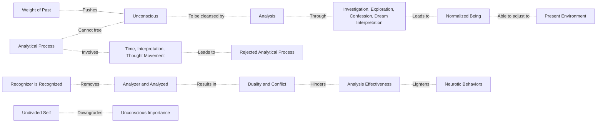

May 29
The burden of the unconscious

Inwardly, unconsciously, there is the tremendous weight of the past pushing you in a certain direction.
Now, how is one to wipe all that away? How is the unconscious to be cleansed immediately of the past? The analysts think that the unconscious can be partially or even completely cleansed through analysis — through investigation, exploration, confession, the interpretation of dreams, and so on — so that at least you become a “normal” human being, able to adjust yourself to the present environment. But in analysis there is always the analyzer and the analyzed, an observer who is interpreting the thing observed, which is a duality, a source of conflict.
So I see that mere analysis of the unconscious will not lead anywhere. It may help me to be a little less neurotic, a little kinder to my wife, to my neighbor, or some superficial thing like that; but that is not what we are talking about. I see that the analytical process — which involves time, interpretation, the movement of thought as the observer analyzing the thing observed — cannot free the unconscious; therefore I reject the analytical process completely. The moment I perceive the fact that analysis cannot under any circumstances clear away the burden of the unconscious, I am out of analysis. I no longer analyze. So what has taken place? Because there is no longer an analyzer separated from the thing that he analyzes, he is that thing. He is not an entity apart from it. Then one finds that the unconscious is of very little importance.

