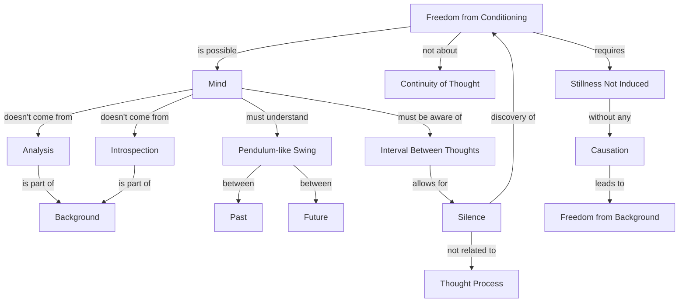

May 30
The interval between thoughts

Now, I say it is definitely possible for the mind to be free from all conditioning — not that you should accept my authority. If you accept it on authority, you will never discover, it will be another substitution and that will have no significance.
The understanding of the whole process of conditioning does not come to you through analysis or introspection, because the moment you have the analyzer that very analyzer himself is part of the background and therefore his analysis is of no significance.
How is it possible for the mind to be free? To be free, the mind must not only see and understand its pendulum -  like swing between the past and the future but also be aware of the interval between thoughts.
If you watch very carefully, you will see that though the response, the movement of thought, seems so swift, there are gaps, there are intervals between thoughts. Between two thoughts there is a period of silence which is not related to the thought process. If you observe you will see that that period of silence, that interval, is not of time and the discovery of that interval, the full experiencing of that interval, liberates you from conditioning — or rather it does not liberate “you” but there is liberation from conditioning. It is only when the mind is not giving continuity to thought, when it is still with a stillness that is not induced, that is without any causation — it is only then that there can be freedom from the background.

