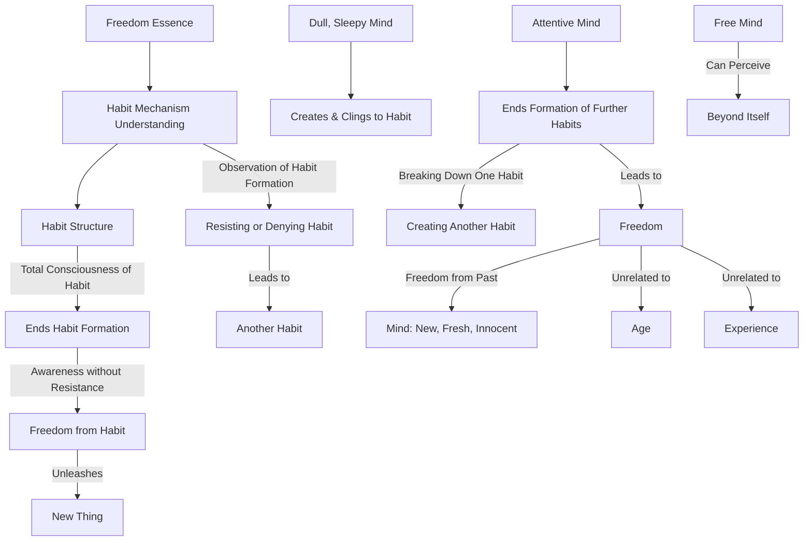

May 31
Observe how habits are formed

Without freedom from the past there is no freedom at all, because the mind is never new, fresh, innocent. It is only the fresh, innocent mind that is free. Freedom has nothing to do with age, it has nothing to do with experience; and it seems to me that the very essence of freedom lies in understanding the whole mechanism of habit, both conscious and unconscious. It is not a question of ending habit, but of seeing totally the structure of habit. You have to observe how habits are formed and how, by denying or resisting one habit, another habit is created. What matters is to be totally conscious of habit; for then, as you will see for yourself there is no longer the formation of habit. To resist habit, to fight it, to deny it, only gives continuity to habit. When you fight a particular habit you give life to that habit, and then the very fighting of it becomes a further habit. But if you are simply aware of the whole structure of habit without resistance, then you will find there is freedom from habit, and in that freedom a new thing takes place.
It is only the dull, sleepy mind that creates and clings to habit. A mind that is attentive from moment to moment —attentive to what it is saying, attentive to the movement of its hands, of its thoughts, of its feelings — will discover that the formation of further habits has come to an end. This is very important to understand, because as long as the mind is breaking down one habit, and in that very process creating another, it can obviously never be free; and it is only the free mind that can perceive something beyond itself.

