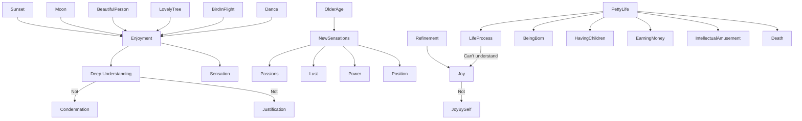

July 2
One must go deep to know joy

Very few of us enjoy anything. We have very little joy in seeing the sunset, or the full moon, or a beautiful person, or a lovely tree, or a bird in flight, or a dance. We do not really enjoy anything. We look at it, we are superficially amused or excited by it, we have a sensation which we call joy. But enjoyment is something far deeper, which must be understood and gone into.
As we grow older, though we want to enjoy things, the best has gone out of us; we want to enjoy other kinds of sensations — passions, lust, power, position. These are all the normal things of life, though they are superficial; they are not to be condemned, not to be justified, but to be understood and given their right place. If you condemn them as being worthless, as being sensational, stupid or unspiritual, you destroy the whole process of living.
To know joy one must go much deeper. Joy is not mere sensation. It requires extraordinary refinement of the mind, but not the refinement of the self that gathers more and more to itself. Such a self, such a man, can never understand this state of joy in which the enjoyer is not. One has to understand this extraordinary thing; otherwise, life becomes very small, petty, superficial — being born, learning a few things, suffering, bearing children having responsibilities, earning money, having a little intellectual amusement and then to die.

