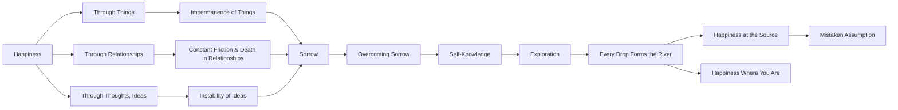

July 5
Can happiness be found through anything?

We seek happiness through things, through relationship, through thoughts, ideas. So things, relationship, and ideas become all-important and not happiness. When we seek happiness through something, then the thing becomes of greater value than happiness itself. When stated in this manner, the problem sounds simple and it is simple. We seek happiness in property, in family, in name; then property, family, idea become all- important, for then happiness is sought through a means, and then the means destroys the end. Can happiness be found through any means, through anything made by the hand or by the mind? Things, relationship, and ideas are so transparently impermanent, we are ever made unhappy by them. Things are impermanent, they wear out and are lost; relationship is constant friction and death awaits; ideas and beliefs have no stability, no permanency. We seek happiness in them and yet do not realize their impermanency. So sorrow becomes our constant companion and overcoming it our problem.
To find out the true meaning of happiness, we must explore the river of self-knowledge. Self-knowledge is not an end in itself. Is there a source to a stream? Every drop of water from the beginning to the end makes the river. To imagine that we will find happiness at the source is to be mistaken. It is to be found where you are on the river of self- knowledge.

