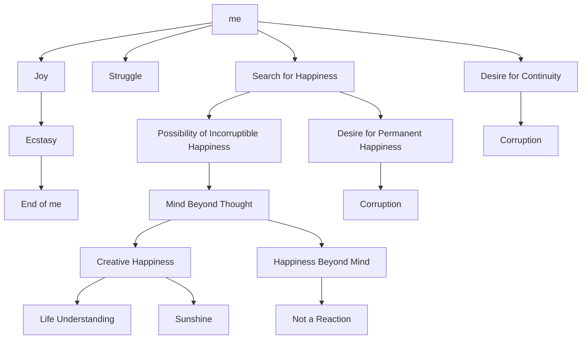

July 6
Happiness that is not of the mind

We may move from one refinement to another, from one subtlety to another, from one enjoyment to another; but at the center of it all, there is “the me” — “the me” that is enjoying, that wants more happiness, “the me” that searches, looks for, longs for happiness, “the me” that struggles, “the me” that becomes more and more refined, but never likes to come to an end. It is only when “the me” in all subtle forms comes to an end that there is a state of bliss which cannot be sought after, an ecstasy, a real joy without pain, without corruption.
When the mind goes beyond the thought of “the me,” the experiencer, the observer, the thinker, then there is a possibility of a happiness that is incorruptible. That happiness cannot be permanent, in the sense in which we use that word. But, our mind is seeking permanent happiness, something that will last, that will continue. That very desire for continuity is corruption.
If we can understand the process of life without condemning, without saying it is right or wrong, then, I think, there comes a creative happiness which is not “yours” or “mine.” That creative happiness is like sunshine. If you want to keep the sunshine to yourself, it is no longer the clear, warm life-giving sun. Similarly, if you want happiness because you are suffering, or because you have lost somebody, or because you have not been successful, then that is merely a reaction. But when the mind can go beyond, then there is a happiness that is not of the mind.

